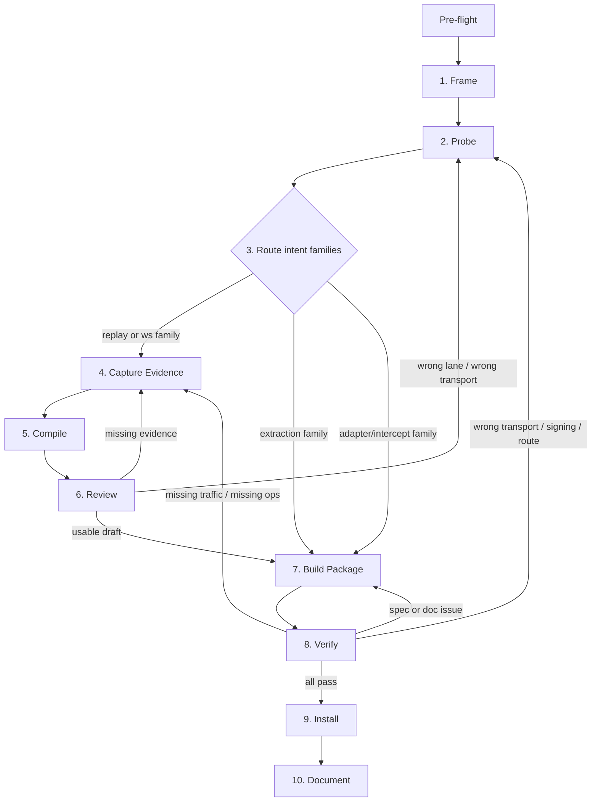

# Add or Expand a Site

> **Audience: site authors** adding or expanding OpenWeb's site coverage. This workflow describes how to capture, probe, and curate a site's API surface (analogous to using browser DevTools to understand a site). End users running `openweb <site> <op>` do not enter this workflow.

Complete workflow for adding a new site package or expanding an existing one.



## Pre-flight Decisions

### Mode

Your scope determines which steps to skip:

- **New site:** Run all steps.
- **Adding ops to existing site:** Skip Capture/Compile for families that already have working ops. Read existing SKILL.md and DOC.md first.
- **Upgrading transport/stability:** Skip Framing (intents already exist). Focus on Probe with fresh eyes — see knowledge/transport-upgrade.md.

When in doubt, don't skip — run the step. Skipping a probe is more expensive than running an unnecessary one.

### Incremental Mode (Existing Site)

Read the runtime package first: `DOC.md`, `openapi.yaml`, and `examples/` from
`src/sites/<site>/` or `$OPENWEB_HOME/sites/<site>/`. If you are in the source
repo, also read `src/sites/<site>/SKILL.md` and `PROGRESS.md` — those source
docs are not shipped into `$OPENWEB_HOME/sites/<site>/`. Identify gaps against
the target intents.
Only the intent families with gaps re-enter Frame and Probe; everything
else stays as-is.

### Net-New Mode

Read these knowledge files in order. Each produces a decision or a
hypothesis to confirm during Probe.

1. **`knowledge/archetypes.md`** — identify archetype, read expected operations.
   **Decision:** Target operations for discovery.

2. **`knowledge/bot-detection.md`** — check for site or vertical.
   **Hypothesis:** Expected bot-detection level (none / soft / hard). Confirm
   in Probe; runtime knobs (real Chrome profile, short sessions) are decided
   from Probe evidence, not pre-flight.

3. **`knowledge/auth-routing.md`** — scan routing table.
   **Hypothesis:** Likely auth family for the archetype. Probe confirms
   whether target endpoints actually require auth. Default: if any target
   intent plausibly needs auth, log in before Capture — unauthenticated
   capture silently misses auth-required endpoints.

### Pre-flight Exit Criteria

- Target site archetype understood
- Likely auth family noted
- Likely bot-detection level noted
- Scope reduced to the families that actually need work

## Critical Rules

### Browser First, No Direct HTTP

**NEVER use curl, fetch, wget, or direct HTTP to probe a site.** Bot
detection tracks IP reputation. A single non-browser request raises the risk
score, poisoning subsequent browser sessions.

### Write Operation Safety

| Level | Examples | Rule |
|-------|----------|------|
| SAFE | like, bookmark, follow, add-to-cart | Capture freely, reversible |
| CAUTION | send message (to self), post (then delete) | Only in safe contexts |
| NEVER | purchase, delete account, send to others | Do not trigger |

Verify skips write ops by default (`replaySafety: unsafe_mutation`).

---

## Step 1: Frame

Define 3-5 target intents as **user actions**, not API names.

**Group into intent families.** An intent family is a group of target intents
that share the same surface and likely the same runtime lane. Example:
- `searchProducts` -> search surface
- `getProductDetail`, `getProductReviews`, `getProductPrice` -> detail surface

For each family:
- mark as read, write, or realtime
- identify one representative page or flow
- note whether safe writes must be exercised during later capture

Create or update `src/sites/<site>/SKILL.md` with initial overview and
target-intent checklist, and `DOC.md` with internal notes.
Read `add-site/document.md` for templates.

**Write intents** — add writes for core interactions (social: like/follow/
bookmark/repost; commerce: add-to-cart/wishlist). Perform ALL safe writes
during capture — missing one means missing that operation.

**Exit criteria:** Every target intent belongs to a family. Each family has
one representative page or flow. Draft SKILL.md and DOC.md exist or are updated.

---

## Step 2: Probe

Discover data source, transport constraints, auth/signing signals, and the
runtime lane for each family — **before** committing to capture or compile.

**Rules:** browser only, no direct Node HTTP probes, one family at a time,
keep sessions short, watch for block pages / redirect loops / rate limits as
early stop signals.

### Probe Protocol Summary

Run the probe in one managed-browser CDP session. Full protocol with CDP code,
troubleshooting, and edge cases: `add-site/probe.md`.

1. **Connect and navigate** — CDP attach, go to representative URL, wait for hydration
2. **Health check** — detect challenge/block patterns in title/URL
3. **Inventory SSR sources** — `__NEXT_DATA__`, LD+JSON, `__INITIAL_STATE__`, DOM selectors
4. **Intercept network/WS** — new page, listener before navigation, filter static/tracking
5. **Test browser-side fetch** — replay one API via `page.evaluate(fetch)`, check shape match
6. **Inspect auth/CSRF/signing/bot-detection** — cookies, headers, rotation patterns
7. **Record transport hypothesis** — `node_candidate` | `page_required` | `adapter_required` | `intercept_required` | `extraction`
8. **Persist probe matrix** — write to DOC.md `## Internal: Probe Results`

### Probe Matrix

One row per family in DOC.md. See `add-site/probe.md` for full format and
column definitions. Common values (not enums — use natural language for novel
situations): evidence kind (`api`, `graphql`, `ssr`, `dom`, `mixed`), lane
(`replay`, `extraction`, `adapter/intercept`, `ws`), capture mode (`none`,
`micro`, `targeted`, `broad`), compile role (`required`, `helpful`, `skip`).

If the family is write-oriented, note login/CSRF requirements. If GraphQL
persisted queries are present, record explicitly. If rate-limited, stop and
route conservatively.

**Exit criteria:** For every family — evidence kind known, transport hypothesis
recorded, auth/CSRF/signing hypothesis recorded, lane chosen, capture mode
chosen, compile role chosen.

---

## Step 3: Route Intent Families

Convert probe evidence into a family lane and artifact plan.

### Routing Table

| Probe evidence | Lane | Capture mode | Compile role | Build direction |
|---|---|---|---|---|
| Rich SSR/JSON/DOM data, no useful API | extraction | none | skip | declarative extraction if simple, adapter if complex |
| Stable replayable REST/GraphQL, browser replay works, compile will help | replay | micro or targeted | required | capture-backed compile flow |
| Stable replayable REST/GraphQL, browser replay works, compile may help little | replay | none or micro | helpful | conservative default is still micro or targeted |
| Site JS succeeds but browser replay fails, or per-request signing rotates | adapter/intercept | none or micro | helpful | adapter or passive intercept path |
| Multi-step UI, DOM interaction, logical ops not 1:1 with URLs | adapter | none or micro | optional | adapter path |
| WS is primary data channel | ws | targeted or broad | required | capture-backed WS compile flow |

### Routing Rules

- Route by intent family, not whole site. Mixed sites are expected.
- Adapter/intercept is a normal route outcome, not a late escalation.
- Do not claim final `node` transport from probe alone — probe can only
  produce `node_candidate`.

### Skip Rules

**Skip Capture** when: the family has a clean extraction path; the family has
a direct adapter/intercept path and compile would add little; the family is
unchanged and existing verified evidence still holds.

**Skip Compile** when: no HAR was collected for the family; the family is
extraction-only; the family is adapter/intercept-only and compile would not
materially improve schema/examples/auth understanding.

**Skip Review** when: compile was skipped for that family.

**Skip Broad Capture** unless: the surface is still unknown after probe; WS
discovery needs it; micro or targeted capture did not produce enough evidence.

**Exit criteria:** Every family has a lane, a capture mode, and a compile role.

---

## Step 4: Capture Evidence

Collect only the traffic needed for families that Route assigned a capture
mode other than `none`.

```bash
openweb capture start --isolate --url https://<site-domain>
# browse to trigger each target intent
openweb capture stop --session <session-id>
```

`--isolate` records only the dedicated tab's traffic. Output goes to
`./capture/` by default, or `./capture-<session-id>/` with `--isolate`
(unless `--output <dir>` overrides it).

Read `add-site/capture.md` for capture modes, auth injection, scripted
capture, and troubleshooting.

### Capture Mode Guidance

| Mode | When to use |
|---|---|
| **micro** (1-3 requests) | Endpoint already known; compile could save manual schema/example/auth work; broad capture would mostly add noise |
| **targeted** | Family needs param variation; GraphQL clustering matters; path normalization or pagination discovery matters; multiple sibling intents share the family |
| **broad** | Surface still not understood after probe; WS discovery needs longer observation; replay family genuinely contains many unknown operations |

### Capture Rules

- Capture follows probe findings, not replaces them.
- If auth or CSRF depends on a mutation, include at least one safe reversible
  write in the capture.
- Use in-app navigation and browser-context fetches where appropriate.
- Avoid blind browsing.

**Exit criteria:** `traffic.har` exists. Every capture-backed family has the
evidence it asked for. The HAR is intentionally scoped to the decision being
answered.

---

## Step 5: Compile

Run only for families whose capture mode is not `none`.

```bash
openweb compile <site-url> --capture-dir <capture-dir>
```

Runs: analyze -> auto-curate -> generate -> verify.

| Output | Location |
|--------|----------|
| `analysis-summary.json`, `analysis.json`, `analysis-full.json`, `verify-report.json`, `summary.txt` | `$OPENWEB_HOME/compile/<site>/` |
| `openapi.yaml`, `asyncapi.yaml` (if WebSocket operations exist), `manifest.json`, `examples/` | `$OPENWEB_HOME/sites/<site>/` |

Auto-curation accepts all clusters, picks top auth candidate, uses
suggested camelCase operation names.

### Compile's Role Under Probe-First

Compile materializes draft artifacts — it does not override probe conclusions.
Transport and extraction signals defer to probe. Compile is retained for:

- Schema inference from traffic
- Example generation
- authCandidates and csrfOptions ranking
- GraphQL sub-clustering
- Path normalization
- OpenAPI / AsyncAPI emission

**Exit criteria:** Compile-backed families have draft artifacts.
`analysis-summary.json` exists for review.

---

## Step 6: Review

Check `summary.txt`, then `verify-report.json`. Cross-check compile output
against the probe matrix.

Read `add-site/review.md` for detailed analysis reading (start with
`analysis-summary.json`).

| `driftType` | Action |
|-------------|--------|
| `auth_drift` | Auth expired or no browser for cookies |
| `schema_drift` | Response shape changed |
| `endpoint_removed` | Wrong path, network error, or site down |
| `error` | Check `detail` (e.g., "no browser tab open") |

### Failure-Based Loop Targets

| Situation | Return to |
|-----------|-----------|
| Missing family coverage, missing evidence | Capture (Step 4) |
| Wrong target domain or evidence scope | Capture (Step 4) |
| Compile output contradicts family lane or transport hypothesis | Probe (Step 2) |
| Intents mapped to operations, usable draft | Continue to Build Package (Step 7) |
| Auth contamination (off-domain cookies) | Re-capture with `--isolate` |
| Site blocked | Document in DOC.md, inform user |

**Adapter escalation** — write an adapter when: per-request headers change
every call (signing), same op returns different hashes (query rotation),
or op works in browser but 404s from `page.evaluate(fetch)`.

**SSR-heavy:** Many noise ops, zero data ops = SSR-delivered data. Write
an adapter. **GraphQL persisted queries:** Deployment-scoped hashes; on
"PersistedQueryNotFound", re-capture or adapter. See `knowledge/graphql.md`.

**Exit criteria:** Every compile-backed family is either accepted for build or
explicitly routed back to Probe or Capture. All target intents have operations.

---

## Step 7: Build Package

Assemble all families into one site package. This is the merge step for mixed
sites — replay-backed operations from compile output, extraction operations
from probe evidence, and adapter/intercept operations from direct authoring
all converge here.

Edit the generated spec and docs. Artifacts stay in
`$OPENWEB_HOME/sites/<site>/`.

1. **Merge** (if existing) — read `add-site/curate-operations.md`
2. **Operations** — `add-site/curate-operations.md` (noise, naming, params)
3. **Runtime** — `add-site/curate-runtime.md` (auth/CSRF, transport, extraction)
4. **Schemas** — `add-site/curate-schemas.md` (schemas, examples/PII)
5. **DOC.md** — if you can't write a clear workflow, revisit naming/grouping
6. **PROGRESS.md** — append entry

### Adapter/Intercept Build Guidance

Read `add-site/curate-runtime.md` § Intercept Pattern for the canonical
`interceptApi()` template and real examples (Home Depot, JD, Instacart).

Adapter openapi.yaml paths are logical namespaces (not real URLs). Each
adapter operation needs:

```yaml
x-openweb:
  adapter:
    name: site-name
    operation: operationName
  transport: page
```

Adapter `.ts` files are authored directly in `src/sites/<site>/adapters/`
(see Package Lifecycle in Install step).

### Build Rules

- Transport starts from the probe hypothesis.
- `node_candidate` must still survive verify before it is trusted.
- Keep auth site-level unless an operation is genuinely public.
- Use compile artifacts when present; add manual examples when compile was
  skipped.
- Keep intercept families on passive interception during implementation
  instead of forcing blind recapture.
- After direct `src/sites/` edits for adapter-only or extraction-only
  families, run `pnpm build` before runtime verify when cache precedence
  would otherwise hide the new files.

**Auth preservation:** Auth is site-level. Even if read ops pass without it,
removing auth/csrf from `servers[0].x-openweb` breaks all write ops.

### Param Traceability

Every operation parameter must trace to a concrete source. Before finalizing
the package, walk each write/mutation op and verify:

1. **For each required param** — which read op's response field provides it?
2. **Document the chain** in SKILL.md with `→ fieldName` arrows
3. **Multi-hop chains** (read → read → write) must show every intermediate step

If a write op param cannot be traced to any read op's output, either:
- A read op is missing from the spec (add it), or
- The param source is unclear (document it explicitly — user-provided, constant, etc.)

**Canonical example** — Uber Eats `addToCart` param traceability:

| Param | Source |
|-------|--------|
| `storeUuid` | `searchRestaurants` → `storeUuid` |
| `itemUuid` | `getRestaurantMenu(storeUuid)` → `catalogItems[].uuid` |
| `customizations` | `getItemDetails(storeUuid, sectionUuid, subsectionUuid, menuItemUuid)` → `customizationsList[].options[].uuid` |

Every `←` in the Operations table and every `→` in a Workflow must have a
matching field name — no anonymous arrows.

**Exit criteria:** `openapi.yaml` and/or `asyncapi.yaml` represent all target
families. Extraction and adapter configuration exist where needed. Examples
exist for runtime verify. DOC.md and PROGRESS.md updated enough for
verification.

---

## Step 8: Verify

**Must be performed by an independent agent** — not the agent that built
the package.

Read `add-site/verify.md` for the full process covering three dimensions:
- **Runtime** — do operations return data?
- **Spec** — does the spec follow curation standards?
- **Doc** — does DOC.md follow the template?

### Failure-Based Loop Table

| Failure | Return to |
|---|---|
| 403 / 999 / bot block / redirect loop / wrong signing | Probe (Step 2) |
| Missing operation / missing evidence / missing write-time token | Capture (Step 4) |
| Schema, naming, doc, or merge-quality issue | Build Package (Step 7) |
| Auth expired | Login and rerun verify |

### Verify Rules

- Runtime must cover every target intent with at least one working operation.
- Spec must meet curation standards.
- Doc must match the spec and the real workflows.
- Node transport is only trusted after verify passes under runtime conditions.

**Exit criteria:** Runtime, spec, and doc all pass per `add-site/verify.md`.

---

## Step 9: Install

Copy the verified package to the source tree.

```bash
mkdir -p src/sites/<site>
cp -r $OPENWEB_HOME/sites/<site>/* src/sites/<site>/
pnpm build && pnpm test
```

Verify: `ls src/sites/<site>/openapi.yaml`, `openweb sites`, `openweb <site>`.

### Package Lifecycle

Three paths: `$OPENWEB_HOME/sites/` (compile cache),
`src/sites/` (source — edit here), `dist/sites/` (build).

Install behavior depends on how the package was built:
- **Compile-backed families:** copy staged non-adapter artifacts from
  `$OPENWEB_HOME/sites/<site>/` into `src/sites/<site>/`.
- **Adapter/extraction families with no compile:** the authoritative files
  are already in `src/sites/<site>/`; Install is primarily a
  confirmation/build step, not a copy step.
- **Mixed packages:** install only the staged non-adapter artifacts and
  preserve source-authored adapter files.
- Source-only docs (`SKILL.md`, `PROGRESS.md`) do not come from the staged
  runtime package; keep editing them in `src/sites/<site>/`.

Do not overwrite `adapters/`. Run `pnpm build` after source edits —
it syncs FROM `src/sites/` TO cache/dist, overwriting cache edits.

**Exit criteria:** Build and tests pass. Source-tree files confirmed.

---

## Step 10: Document

Read `add-site/document.md` for the three-file model, templates, and knowledge
update criteria.

Update all three per-site doc files:

1. **SKILL.md** — Finalize user-facing doc: overview, workflows with cross-op
   data flow, operations table, quick start commands, known limitations.
2. **DOC.md** — Finalize developer doc: auth, transport decisions and evidence,
   adapter patterns, known issues. Clean up probe results to settled
   conclusions only.
3. **PROGRESS.md** — Append entry with context, changes, verification results,
   key discoveries, and pitfalls encountered.
4. **manifest.json** — Verify site metadata is current.

- Document family lanes used by the site, transport limits, bot-detection
  constraints, and why compile was skipped for any family (in DOC.md).
- If you learned something that generalizes across sites, write to
  `knowledge/`.
- If you hit pipeline friction (not site-specific), write
  `src/sites/<site>/pipeline-gaps.md`.

**Exit criteria:** SKILL.md, DOC.md, and PROGRESS.md finalized per templates.
Knowledge updated if applicable. Pipeline gaps documented if any.
